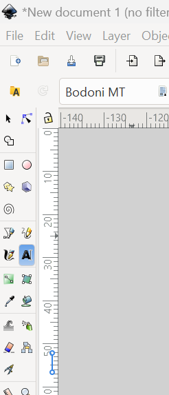
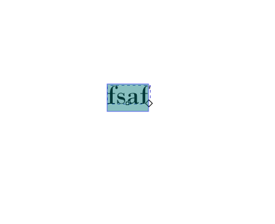
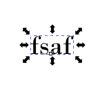
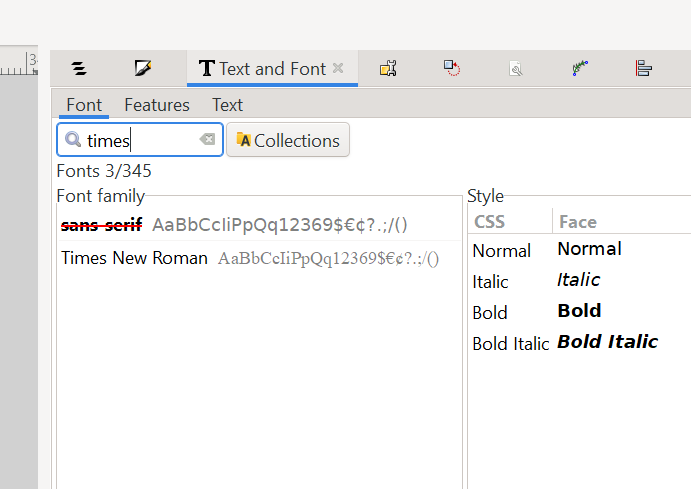
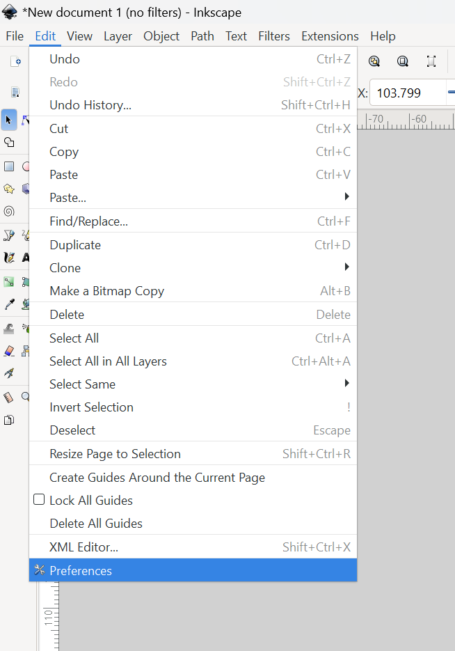
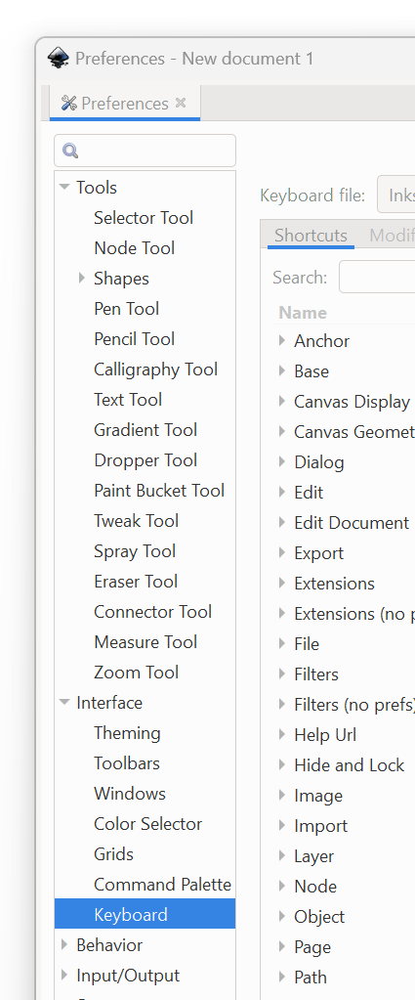
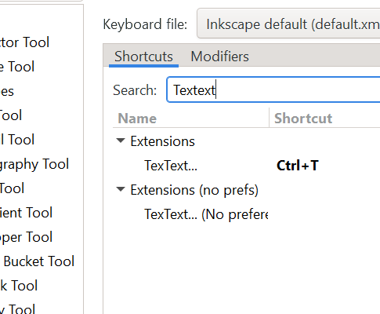
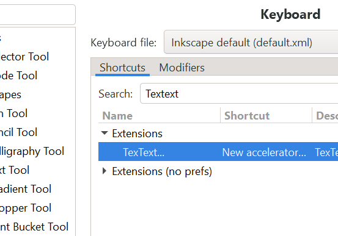

# Inkscape Defaults

This repository contains default settings and tools for Inkscape, specifically configured for HARP Research Inc.

## Installation Instructions

1. Install Inkscape 1.4:

   - Download from [Inkscape&#39;s official website](https://inkscape.org/release/inkscape-1.4/)
   - Run the installer and follow the installation wizard
2. Install TexText Extension:

   - Download the latest version (1.11.0) from [TexText Releases](https://github.com/textext/textext/releases)
   - Follow the installation instructions provided in the TexText documentation

## Contents

- Default Inkscape configuration files
- HARP LaTeX preamble for TexText
- Additional tools and settings

## Tutorial

1. Install Inkscape 1.4
2. Install TexText Extension

### Set default Inkscape font to Times New Roman
   - First, create a text block by clicking on the text tool on the sidebar, then clicking somewhere in the blank document

   - Press escape to exit text entry mode, then after the cursor changes click back on the text box once to select it as an object. It should have draggable handles around it.
   

   - Then, in the Text and Fonts tab, find the `Times New Roman` font as such:
     

   - Click on the `Times New Roman` font and click on the `Set as Default` button.

### Defining keyboard shortcut for opening TexText dialog

   - In Inkscape open Edit -> Preferences -> Interface -> Keyboard -> Shortcuts

   - Search for TexText entry in the Extensions category

   

   - Double click on the empty space in the Shortcut column next to the TexText entry. An entry New accelerator appears in the Shortcut column.
   

   - Now type the keyboard shortcut you intend to use, e.g. CTRL + T. Inkscape informs you if the shortcut is already in use.
   

   - After you have set the shortcut, press escape, then click x to close the dialog.

3. Set Render LaTeX to 
3. Open Inkscape
4. Open the TexText Extension
5. Select the LaTeX preamble